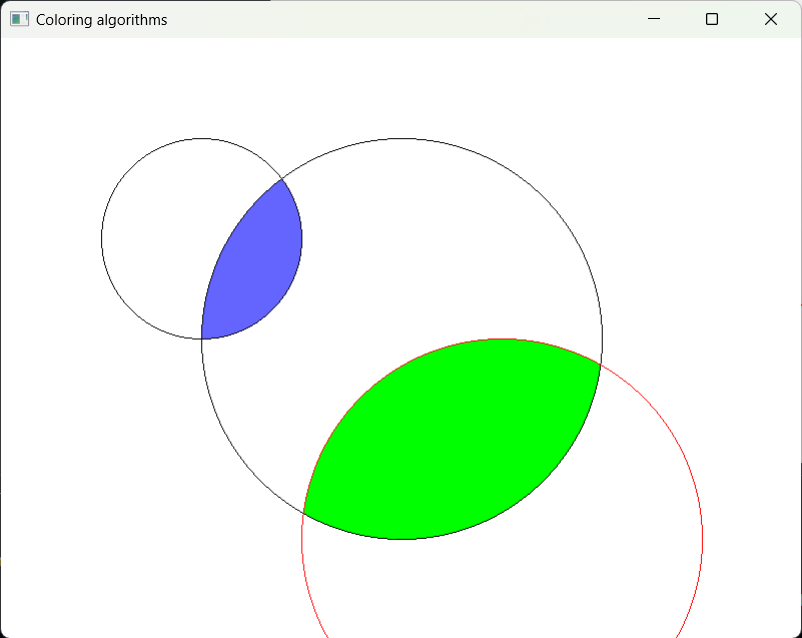
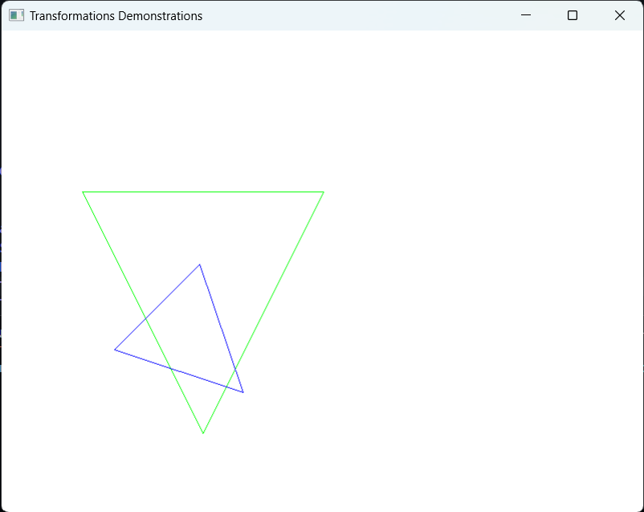

# the-introductory-graphics
The aim of this project is to study and implement basic drawing algorithms as a part of my studies.

Currently the following algorithms and their demonstrations are implemented.

### 1. Digital Differential Analyzer Line Drawing Algorithm

Code: [Source File](./src/DDADemo/main.cpp)

### 2. Mid Point Circle Drawing Algorithm

Code: [Source File](./src/MidPointCircleDemo/main.cpp)

### 3. Mid Point Ellipse Drawing Algorithm

Code: [Source File](./src/MidPointEllipseDemo/main.cpp)

### 4. Flood Fill Demonstration

Code: [Source File](./src/ColorFillDemo/main.cpp)

### 5. Transformation Demonstration

Code: [Source File](./src/TransformationsDemo/main.cpp)

### Dependencies
The Dependencies used by this project is enlisted in the [Dependencies Directory](./Dependencies/). 